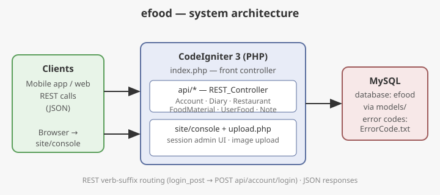

# efood

**efood** is a REST API backend for a food / calorie-tracking app (食物卡路里記錄), built on **CodeIgniter 3** with the [codeigniter-restserver](https://github.com/chriskacerguis/codeigniter-restserver) library. Mobile or web clients talk to the `api/*` endpoints to manage accounts, daily food diaries, restaurants and their menus, user-defined foods, and notes. A small session-based web console (`site/console`) lets administrators browse restaurants and food items.



## Features

### REST API (`application/controllers/api/`)

All endpoints are served by controllers extending `REST_Controller`; methods use the HTTP-verb suffix convention (e.g. `login_post()` → `POST api/account/login`).

| Controller | Endpoints |
|---|---|
| `Account` | `login`, `googleLogin`, `getToken`, `create` (register), `createGoogle`, `exist` (account check), `updateStartDate`, `getAccountInfo`, `updateAccountInfo`, `updateAccountTarget`, `getFoodLogs`, `upload` (avatar) |
| `Diary` | `setDailyWeight`, `getDailyWeight`, `addFoodLog`, `addFoodLogEx`, `delFoodLog`, `listFoodLog` |
| `Restaurant` | `list` (restaurants), `listFoods`, `listRestaurantFoods` |
| `FoodMaterial` | `list` (food material catalog) |
| `RestaurantFood` | `list` (menu items of a restaurant) |
| `UserFood` | `add`, `delete` (user-defined custom foods) |
| `Note` | `add`, `update`, `remove`, `get` |
| `Example` | Sample `users_get/users_post/users_delete` from the rest-server library |

### Web console

- `site/Console` (`application/controllers/site/Console.php`, view `application/views/site/console.php`): session-login admin page that lists restaurants and food items for content management.
- `Upload` (`application/controllers/upload.php`): file upload form — accepts `gif|jpg|png` up to 100 KB into `./uploads/`.

### Error codes

`ErrorCode.txt` (in Chinese) defines the API error codes: `0` 未知錯誤 (unknown error), `1` Success, `1000–1999` account-related (e.g. `1001` Token 驗證失敗, `1010` 帳號已存在), `2001/2002` calorie-calculator food errors, `9001` note errors.

## Tech stack

- PHP ≥ 5.4
- CodeIgniter 3 (`system/`)
- codeigniter-restserver library (`application/libraries/REST_Controller.php`, `Format.php`; config in `application/config/rest.php`)
- MySQL (`application/config/database.php`: host `127.0.0.1`, user `admin`, database `efood`)

## Directory structure

```
efood/
├── index.php                 # front controller (entry point)
├── application/
│   ├── controllers/
│   │   ├── api/              # REST API controllers (Account, Diary, Restaurant, ...)
│   │   ├── site/Console.php  # admin web console
│   │   └── upload.php        # image upload
│   ├── models/               # DB models (Account, DailyFoodLog, FoodMaterial, Restaurant, ...)
│   ├── views/site/console.php# admin console view
│   ├── config/database.php   # DB connection settings
│   ├── config/rest.php       # REST server settings (auth, keys, rate limits)
│   ├── libraries/REST_Controller.php  # the rest-server library
│   └── migrations/           # rest-server tables (keys, logs, limits)
├── system/                   # CodeIgniter 3 framework
├── assets/                   # front-end assets for the console
├── uploads/                  # uploaded images
├── user_guide/               # CodeIgniter user guide
└── ErrorCode.txt             # API error code reference (Chinese)
```

## Setup

1. **Requirements:** PHP 5.4+, a web server (Apache/Nginx), and MySQL.
2. **Create the database:** create a MySQL database named `efood` (and import your schema).
3. **Configure the DB connection** in `application/config/database.php` — the committed defaults are:
   ```php
   'hostname' => '127.0.0.1',
   'username' => 'admin',
   'password' => '...',   // set your password
   'database' => 'efood',
   ```
   Change these to match your environment.
4. **Point the web server document root at this directory** (it contains `index.php`, the front controller), e.g. an Apache virtual host or Nginx `root`.
5. **Make `uploads/` writable** by the web server user.
6. **Optional — API keys / rate limits:** see `application/config/rest.php`. The rest-server tables can be created from the migrations in `application/migrations/` (note: `$config['migration_enabled']` is `FALSE` by default in `application/config/migration.php`).

Smoke test: open `http(s)://<your-host>/index.php` — you should see the CodeIgniter welcome page. API calls then look like:

```bash
curl -X POST http(s)://<your-host>/index.php/api/account/login
```

## License

This project bundles the CodeIgniter framework (see `license.txt`, MIT © 2014–2017 British Columbia Institute of Technology) and the codeigniter-restserver library (see `LICENSE`, MIT © 2012–2015 Phil Sturgeon, Chris Kacerguis). No separate license file is provided for the efood application code itself.
